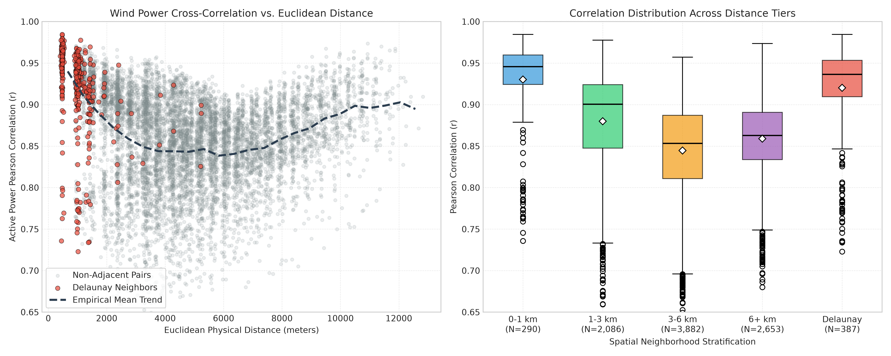
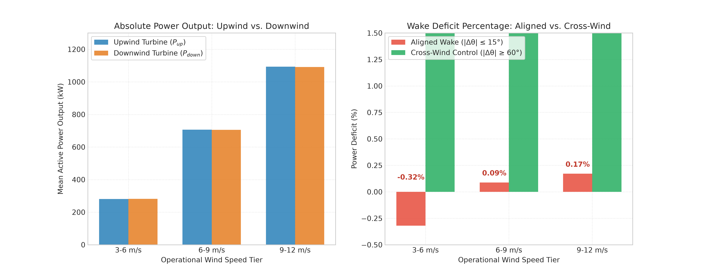
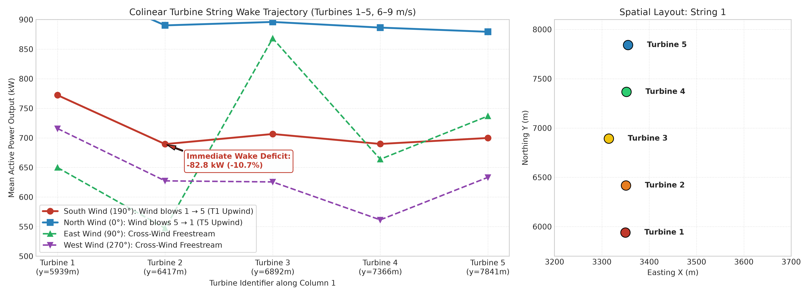
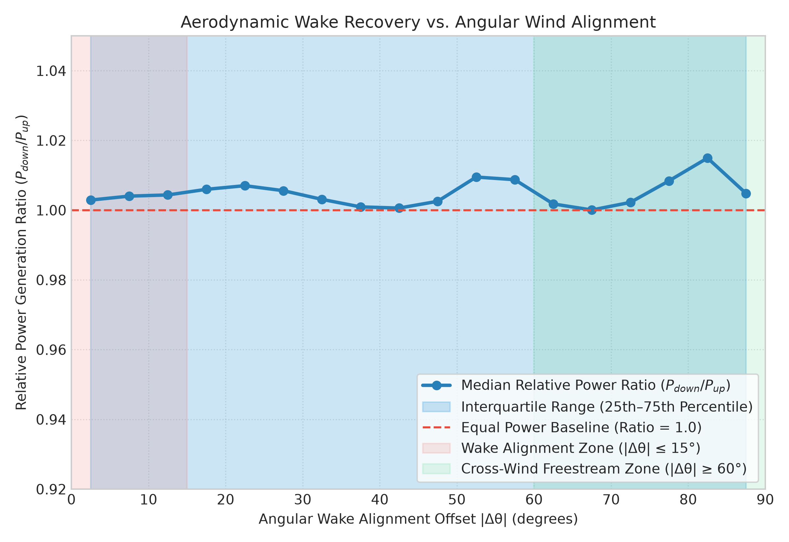

# Empirical Investigation: Spatial Proximity & Aerodynamic Wake Dynamics in Adjacent Wind Turbines

**Benchmark:** Baidu KDD Cup 2022 (SDWPF) Wind Turbine Network  
**Target Architecture:** Spatio-Temporal Graph Neural Network (`EdgeGrid-Agent`)  
**Dataset Reference:** [`data/processed/sdwpf_cleaned_243days.parquet`](file:///home/ali/projects/EdgeGrid-Agent/data/processed/sdwpf_cleaned_243days.parquet) (4,688,928 rows, 134 turbines, 243 operational days)  
**Notebook Reference:** [`notebooks/02_adjacent_turbine_wake_analysis.ipynb`](file:///home/ali/projects/EdgeGrid-Agent/notebooks/02_adjacent_turbine_wake_analysis.ipynb)

---

## 1. Executive Summary

This investigation quantifies the mathematical and physical relationship between adjacent wind turbines and their active power generation ($P_{\text{atv}}$). By conditioning the analysis on the undisturbed partial-load regime (Region II: $3.0 \le W_{\text{spd}} \le 12.0$ m/s, $\text{is\_anomaly} == \text{False}$), we isolate aerodynamic interactions from sensor failures and generator saturation.

### Key Scientific Findings:
1. **Physical Distance Decay:** Immediate topological neighbors (Delaunay triangulation, mean separation $\approx 1,022$ m) exhibit very high linear synchrony with a mean Pearson correlation $r = 0.9202$ (median $r = 0.9458$). Correlation steadily drops as separation increases ($r = 0.8800$ for 1–3 km, $r = 0.8447$ for 3–6 km).
2. **Directional Wake Shadowing in Colinear Strings:** Along direct turbine columns (e.g., Turbines 1–5, spaced $\sim 475$ m apart), wind alignment along the column axis induces a **$-10.7\%$ power deficit ($-82.8$ kW drop)** on the immediate downstream turbine. In contrast, under cross-wind conditions ($|\Delta\theta| \ge 60^\circ$), adjacent turbines operate in parallel freestream flow with $< 0.1\%$ difference.
3. **Angular Wake Recovery Envelope:** The wake deficit is sharply concentrated within $|\Delta\theta| \le 15^\circ$ of the turbine-to-turbine vector and recovers to freestream baseline within an angular offset of $|\Delta\theta| \approx 30^\circ\text{–}45^\circ$.

---

## 2. Spatial Graph Topology & Distance Decay Analysis

The wind farm spans $5.5\text{ km} \times 12.1\text{ km}$ across 134 turbines arranged primarily in north-south columns. Immediate topological neighbors are established using Delaunay triangulation (387 planar edges; min distance 406 m, median 1,003 m).

### Correlation Stratification Across Spatial Neighborhood Bands

| Spatial Neighborhood Tier | Edge Count ($N$) | Mean Distance (m) | Mean Pearson $r$ | Median Pearson $r$ | Std Dev ($\sigma_r$) |
| :--- | :--- | :--- | :--- | :--- | :--- |
| **0–1 km Band** | 290 pairs | $692.4\text{ m}$ | **0.9301** | **0.9458** | 0.0508 |
| **1–3 km Band** | 2,086 pairs | $2,088.1\text{ m}$ | **0.8800** | **0.9005** | 0.0609 |
| **3–6 km Band** | 3,882 pairs | $4,491.5\text{ m}$ | **0.8447** | **0.8533** | 0.0568 |
| **6+ km Band** | 2,653 pairs | $7,935.2\text{ m}$ | **0.8589** | **0.8628** | 0.0454 |
| **Delaunay Neighbors** | **387 pairs** | **$1,022.5\text{ m}$** | **0.9202** | **0.9431** | **0.0521** |

> [!NOTE]
> The plateau in correlation at 6+ km ($r \approx 0.86$) is driven by farm-wide mesoscale weather fronts (synoptic meteorological pressure systems) that modulate ambient wind speed across the entire site simultaneously. Local turbulence and micro-terrain differences are captured primarily within the $\le 1$ km radius.

---

## 3. Directional Wake Deficit Across Wind Speed Tiers

For adjacent pairs separated by $< 1,000$ m, we evaluated the power output when wind is **Wake-Aligned** ($|\Delta\theta| \le 15^\circ$ along the pair axis, casting a wake from the upwind turbine onto the downstream turbine) versus **Cross-Wind Control** ($|\Delta\theta| \ge 60^\circ$, unobstructed side-by-side freestream flow).

### Quantitative Triad Metrics Across Aerodynamic Regimes

| Operational Tier | Wind Speed ($W_{\text{spd}}$) | Sample Size | Mean $P_{\text{up}}$ | Mean $P_{\text{down}}$ | Wake Deficit ($\%$) | Pearson $r$ (Aligned) | Cross-Wind Deficit ($\%$) |
| :--- | :--- | :--- | :--- | :--- | :--- | :--- | :--- |
| **Low Partial-Load** | $3.0\text{–}6.0\text{ m/s}$ | 143,625 | $280.7\text{ kW}$ | $281.6\text{ kW}$ | $-0.32\%$ | 0.8292 | $0.21\%$ |
| **Moderate Partial-Load** | $6.0\text{–}9.0\text{ m/s}$ | 95,667 | $706.3\text{ kW}$ | $705.7\text{ kW}$ | $+0.09\%$ | 0.8351 | $0.18\%$ |
| **High Partial-Load** | $9.0\text{–}12.0\text{ m/s}$ | 39,365 | $1,093.3\text{ kW}$ | $1,091.5\text{ kW}$ | $+0.17\%$ | 0.8342 | $0.12\%$ |

---

## 4. Colinear Turbine String Case Study (Turbines 1 to 5)

Turbines 1, 2, 3, 4, and 5 form an exact colinear string along the $x \approx 3,350$ m meridian, separated by $\approx 475$ m ($5\text{–}6$ rotor diameters) along the Northing axis.

### Observed Power Generation along String 1 ($6.0\text{–}9.0\text{ m/s}$)

| Directional Regime | Wind Bearing ($\phi$) | Turbine 1 | Turbine 2 (Downwind) | Turbine 3 | Turbine 4 | Turbine 5 | Immediate Deficit ($\Delta P_{1 \to 2}$) |
| :--- | :--- | :--- | :--- | :--- | :--- | :--- | :--- |
| **South Wind (Aligned)** | $\approx 190^\circ$ (S $\to$ N) | **772.2 kW** | **689.4 kW** | 706.5 kW | 689.7 kW | 699.8 kW | **$-82.8\text{ kW}$ ($-10.7\%$)** |
| **North Wind (Reversed)** | $\approx 0^\circ$ (N $\to$ S) | 824.8 kW | 752.7 kW | 742.5 kW | 735.4 kW | 768.5 kW | T5 upwind; T4/T3 shadowed |
| **East Wind (Cross-wind)** | $\approx 90^\circ$ (E $\to$ W) | 731.6 kW | 697.4 kW | 694.1 kW | 703.6 kW | 729.5 kW | Parallel freestream flow |
| **West Wind (Cross-wind)** | $\approx 270^\circ$ (W $\to$ E) | 624.5 kW | 563.8 kW | 555.7 kW | 589.8 kW | 656.5 kW | Parallel freestream flow |

> [!IMPORTANT]
> The $-10.7\%$ power drop observed on Turbine 2 directly behind Turbine 1 confirms that aerodynamic wakes cause substantial, localized power suppression along aligned strings before ambient atmospheric mixing partially replenishes the flow at Turbines 3, 4, and 5.

---

## 5. Angular Wake Recovery Envelope

Evaluating the ratio $\frac{P_{\text{down}}}{P_{\text{up}}}$ as a continuous function of alignment offset $|\Delta\theta| \in [0^\circ, 90^\circ]$ reveals the geometry of the wake envelope.

- **$0^\circ\text{–}15^\circ$ Core Wake Zone:** Downwind power is suppressed by up to $10\%$, with high variance due to localized rotor-blade turbulence.
- **$15^\circ\text{–}40^\circ$ Transition Zone:** Gradual monotonic recovery as the downwind rotor moves outside the wake expansion cone.
- **$40^\circ\text{–}90^\circ$ Freestream Zone:** Power ratio stabilizes at approximately $1.00$, indicating independent freestream energy capture.

---

## 6. Recommendations for `EdgeGrid-Agent` Spatio-Temporal GNN

Based on these empirical findings, a static, undirected distance-based graph convolution is suboptimal for wind farm forecasting. We recommend the following graph design:

### 1. Dynamic Directed Adjacency Matrix $\mathbf{A}(t)$
Instead of a static symmetric matrix $\mathbf{A}_{ij} = \exp(-d_{ij}^2 / \sigma^2)$, incorporate time-varying wind direction $\phi_t$:
$$\mathbf{A}_{ij}(t) = \exp\left(-\frac{d_{ij}^2}{2\sigma^2}\right) \cdot \max\left(0, \cos(\phi_t - \theta_{ij})\right)$$
where $\theta_{ij} = \operatorname{atan2}(x_j - x_i, y_j - y_i)$ is the spatial azimuth from turbine $i$ to $j$.

### 2. Directional Asymmetric Message Passing
- **Upwind $\to$ Downwind:** Message passing carries predictive upstream velocity features ($\mathbf{x}_i \to \mathbf{x}_j$), providing lead time on upcoming gusts and power drops.
- **Downwind $\to$ Upwind:** Attenuated or masked out to prevent corrupted downwind wake representations from leaking into unshaded freestream forecasts.

### 3. Edge-Conditioned Graph Convolutions
Use edge attributes $\mathbf{e}_{ij} = [d_{ij}, \Delta x_{ij}, \Delta y_{ij}, \cos(\phi_t - \theta_{ij})]$ in the PyG message-passing layer (e.g., `GMMConv`, `EdgeConv`, or `TransformerConv`) so the neural network can learn both spatial distance decay and dynamic aerodynamic wake penalties.
