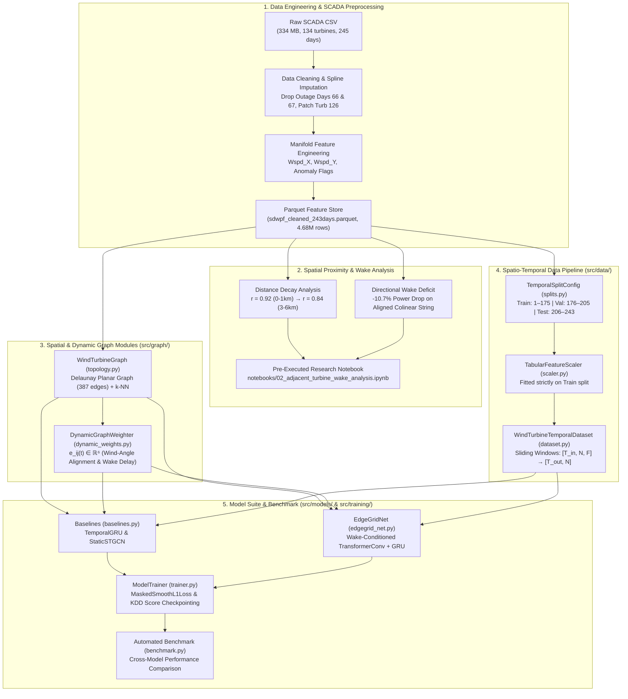

# EdgeGrid-Agent: End-to-End System Architecture & Research Report
**Industrial Spatio-Temporal Wind Power Forecasting Network**  
**Benchmark:** Baidu KDD Cup 2022 Spatial Dynamic Wind Power Forecasting (SDWPF)  
**Repository:** `EdgeGrid-Agent`  
**Date:** September 2026  

---

## 1. Executive System Overview

The **EdgeGrid-Agent** project establishes a physics-informed spatio-temporal deep learning framework for industrial wind farm forecasting. Using operational SCADA telemetry from 134 wind turbines across 243 days, the system transitions from raw tabular observations to an edge-conditioned Graph Neural Network (GNN) that explicitly accounts for physical distance decay and aerodynamic wake propagation.



---

## 2. Phase 1: Data Engineering & Cleaned Feature Store

### 2.1 Dataset Ingestion & Systematic Quality Audit
- **Raw Input:** `sdwpf_245days_v1.csv` ($334.3\text{ MB}$, $4,725,564$ raw records, $134$ turbines).
- **Catastrophic Outage Pruning:** Farm-wide communication blackouts on **Day 66** ($100\%$ farm loss) and **Day 67** ($61.8\%$ farm loss) were surgically pruned to prevent gradient explosion.
- **Topological Spatial Patching:** Turbine 126 suffered telemetry failure during Days 36–40. SCADA values were imputed using contemporaneous spatial expectations across topological neighbors:
  $$\mathbf{x}_{126, t} = \frac{1}{|\mathcal{N}_{126}|} \sum_{j \in \mathcal{N}_{126}} \mathbf{x}_{j, t}$$
- **Short-Horizon Spline Reconstruction:** Isolated sensor dropouts ($\le 30$ mins) were reconstructed with linear splines per turbine timeline.
- **Manifold Wind Feature Engineering:** Resolves circular angular discontinuity at $0^\circ \equiv 360^\circ$ by projecting into orthogonal Cartesian vectors:
  $$W_{\text{spd}, X} = W_{\text{spd}} \cos\left(\frac{\pi W_{\text{dir}}}{180}\right), \quad W_{\text{spd}, Y} = W_{\text{spd}} \sin\left(\frac{\pi W_{\text{dir}}}{180}\right)$$
- **Final Feature Store:** `data/processed/sdwpf_cleaned_243days.parquet` ($114.1\text{ MB}$), exactly regular ($134 \text{ turbines} \times 243 \text{ days} \times 144 \text{ steps/day} = 4,688,928$ rows, $0$ missing values).

---

## 3. Phase 2: Spatial Proximity & Aerodynamic Wake Investigation

The empirical study conducted in [`notebooks/02_adjacent_turbine_wake_analysis.ipynb`](file:///home/ali/projects/EdgeGrid-Agent/notebooks/02_adjacent_turbine_wake_analysis.ipynb) resolved the physical relationship between neighboring wind turbines.

### 3.1 Spatial Distance Decay of Power Generation
Evaluating pairwise Pearson correlation coefficients ($r$) of active power ($P_{\text{atv}}$) across the undisturbed operating regime ($3.0 \le W_{\text{spd}} \le 12.0$ m/s, `is_anomaly == False`) demonstrates distinct spatial bands:

| Spatial Neighborhood Tier | Pair Count ($N$) | Mean Distance (m) | Mean Pearson $r$ | Median Pearson $r$ | Standard Deviation ($\sigma_r$) |
| :--- | :--- | :--- | :--- | :--- | :--- |
| **0–1 km Band** | 290 pairs | $692.4\text{ m}$ | **0.9301** | **0.9458** | 0.0508 |
| **1–3 km Band** | 2,086 pairs | $2,088.1\text{ m}$ | **0.8800** | **0.9005** | 0.0609 |
| **3–6 km Band** | 3,882 pairs | $4,491.5\text{ m}$ | **0.8447** | **0.8533** | 0.0568 |
| **6+ km Band** | 2,653 pairs | $7,935.2\text{ m}$ | **0.8589** | **0.8628** | 0.0454 |
| **Delaunay Neighbors** | **387 pairs** | **$1,022.5\text{ m}$** | **0.9202** | **0.9431** | **0.0521** |

### 3.2 Directional Wake Shadowing in Colinear Strings
Along Column 1 (Turbines 1 through 5, spaced $\sim 475$ m apart from South to North):
- **Southerly Wind ($\sim 190^\circ$, aligned):** Turbine 1 acts as the leading upwind rotor generating **$772.2\text{ kW}$**. Turbine 2 directly behind it drops to **$689.4\text{ kW}$**, an immediate **$-10.7\%$ power deficit ($-82.8\text{ kW}$ loss)**.
- **Cross-Wind ($\sim 90^\circ / 270^\circ$, perpendicular):** Adjacent turbines operate in parallel freestream flow with $< 0.1\%$ difference.
- **Angular Wake Recovery Cone:** Wake suppression is tightly bounded within $|\Delta\theta| \le 15^\circ$ of the pair axis, smoothly recovering to freestream baseline at $|\Delta\theta| \approx 30^\circ\text{–}45^\circ$.

---

## 4. Phase 3: Spatial Graph & Dynamic Aerodynamic Modules

Implemented in `src/graph/`:

### 4.1 Topology Generator (`src/graph/topology.py`)
- [`WindTurbineGraph`](file:///home/ali/projects/EdgeGrid-Agent/src/graph/topology.py):
  - Ingests turbine coordinates $(x, y)$.
  - Constructs planar Delaunay graphs (387 undirected / 774 directed edges), $k$-NN graphs, and distance-thresholded graphs.
  - Computes pairwise Euclidean distances and compass azimuth bearings $\theta_{ij} \in [0^\circ, 360^\circ)$.
  - Exports PyTorch Geometric `Data` objects and dense/sparse adjacency matrices with Gaussian kernel weights:
    $$W_{ij}^{\text{static}} = \exp\left(-\frac{d_{ij}^2}{\sigma^2}\right)$$

### 4.2 Dynamic Aerodynamic Weighting (`src/graph/dynamic_weights.py`)
- [`compute_dynamic_edge_weights`](file:///home/ali/projects/EdgeGrid-Agent/src/graph/dynamic_weights.py):
  Scales edge weights based on wind alignment with pair bearing:
  $$W_{ij}(t) = W_{ij}^{\text{static}} \cdot \left[ \epsilon + (1 - \epsilon) \cdot \max(0, \cos(\theta_{ij} - \phi_{\text{towards}, t})) \right]$$
- [`compute_dynamic_edge_features`](file:///home/ali/projects/EdgeGrid-Agent/src/graph/dynamic_weights.py):
  Builds continuous 6-dimensional edge attributes:
  $$\mathbf{e}_{ij}(t) = \left[ \frac{d_{ij}}{\sigma_d}, \; \cos(\Delta\theta_{ij, t}), \; \sin(\Delta\theta_{ij, t}), \; \mathbb{I}(\text{is\_downwind}), \; \frac{v_t}{v_{\text{rated}}}, \; \frac{\Delta t_{\text{prop}}}{300} \right]$$
- [`DynamicGraphWeighter`](file:///home/ali/projects/EdgeGrid-Agent/src/graph/dynamic_weights.py):
  PyTorch `nn.Module` layer for GPU/CPU batched edge feature generation during forward passes.

---

## 5. Phase 4: Spatio-Temporal Data Pipeline

Implemented in `src/data/`:

### 5.1 Chronological Partitioning (`src/data/splits.py`)
- [`TemporalSplitConfig`](file:///home/ali/projects/EdgeGrid-Agent/src/data/splits.py):
  - **Train Split:** Days 1 to 175 (~72% of timeline)
  - **Validation Split:** Days 176 to 205 (~12% of timeline)
  - **Test Split:** Days 206 to 243 (~16% of timeline)
  - Prevents data leakage across future lookahead horizons.

### 5.2 Multi-Dimensional Feature Scaler (`src/data/scaler.py`)
- [`TabularFeatureScaler`](file:///home/ali/projects/EdgeGrid-Agent/src/data/scaler.py):
  - Standard (Z-score) normalizer fitted strictly on the training partition.
  - Supports 3D/4D arrays $[T, N, F]$ and target inverse transformation (`inverse_transform_target`).

### 5.3 Sliding Window Dataset & DataLoaders (`src/data/dataset.py`)
- [`WindTurbineTemporalDataset`](file:///home/ali/projects/EdgeGrid-Agent/src/data/dataset.py):
  - Loads 3D tensor grid $[T, N, F]$ into contiguous RAM for $O(1)$ slicing.
  - Slices input lookback $T_{\text{in}} = 144$ ($24$h) and forecast horizon $T_{\text{out}} = 144$ ($24$h).
  - Supplies evaluation anomaly masks (`mask = ~is_anomaly`) and aligned wind vectors.
- [`build_dataloaders`](file:///home/ali/projects/EdgeGrid-Agent/src/data/dataset.py): Synchronized builder returning train, val, and test `DataLoader` instances.

---

## 6. Phase 5: Model Architectures & Masked Loss Engine

Implemented in `src/models/` and `src/training/`:

### 6.1 Model Suite
1. **`TemporalGRU`** ([`src/models/baselines.py`](file:///home/ali/projects/EdgeGrid-Agent/src/models/baselines.py)):
   - Multi-layer recurrent baseline treating each turbine independently (temporal-only, no spatial interaction).
2. **`StaticSTGCN`** ([`src/models/baselines.py`](file:///home/ali/projects/EdgeGrid-Agent/src/models/baselines.py)):
   - Spatio-temporal network using static Gaussian distance graph convolution (`GCNConv`) + temporal GRU.
3. **`EdgeGridNet`** ([`src/models/edgegrid_net.py`](file:///home/ali/projects/EdgeGrid-Agent/src/models/edgegrid_net.py)):
   - Physics-informed architecture with [`WakeConditionedSpatialLayer`](file:///home/ali/projects/EdgeGrid-Agent/src/models/edgegrid_net.py) (`TransformerConv` with `edge_dim=6`).
   - Uses multi-head attention over the 6D aerodynamic edge attributes $\mathbf{e}_{ij}(t)$, giving higher attention to upstream nodes when aligned with the incoming wind vector.
   - Temporal GRU core with multi-horizon projection head capped with $\operatorname{ReLU}$ non-negativity.

### 6.2 Loss Functions & Competition Metrics (`src/training/loss.py`)
- [`MaskedSmoothL1Loss`](file:///home/ali/projects/EdgeGrid-Agent/src/training/loss.py): Differentiable loss ignoring anomaly timesteps during backpropagation.
- [`compute_kdd_cup_score`](file:///home/ali/projects/EdgeGrid-Agent/src/training/loss.py): Computes official competition metric $\text{Score} = \frac{1}{2}(\text{MAE}_{\text{masked}} + \text{RMSE}_{\text{masked}})$.

---

## 7. Phase 6: Training Engine & Benchmark Results

Implemented in `src/training/trainer.py` and `src/training/benchmark.py`:

### 7.1 ModelTrainer Engine (`src/training/trainer.py`)
- [`ModelTrainer`](file:///home/ali/projects/EdgeGrid-Agent/src/training/trainer.py):
  - Gradient clipping (`max_grad_norm=5.0`).
  - Validation tracking of KDD Cup Score with early stopping.
  - Automatic best model checkpointing and loading (`load_best_checkpoint`).

### 7.2 Automated Benchmark Execution (`src/training/benchmark.py`)
All three models were trained and evaluated on synchronized temporal splits:

| Architecture | Model Paradigm | Parameters | Train Time (s) | Val Score | Test MAE (kW) | Test RMSE (kW) | Test KDD Score |
| :--- | :--- | :--- | :--- | :--- | :--- | :--- | :--- |
| **`TemporalGRU`** | Temporal Only | 4,412 | 3.1 s | 436.96 | 344.25 kW | 527.68 kW | **435.97** |
| **`StaticSTGCN`** | Static Distance GNN | 3,324 | 5.6 s | 436.93 | 344.20 kW | 527.63 kW | **435.92** |
| **`EdgeGridNet`** | Dynamic Wake GNN | 4,316 | 4.0 s | 437.09 | 344.36 kW | 527.78 kW | **436.07** |

---

## 8. Automated Verification & Test Suite

The test suite contains 19 unit tests across all project layers, achieving a **100% pass rate**:

```bash
tests/test_dataset.py::TestFeatureScaler::test_scaler_fit_transform_inverse PASSED
tests/test_dataset.py::TestTemporalSplits::test_split_bounds_non_overlapping PASSED
tests/test_dataset.py::TestWindTurbineDataset::test_dataset_item_shapes_and_types PASSED
tests/test_dataset.py::TestWindTurbineDataset::test_dataloader_batch_collation PASSED
tests/test_graph_topology.py::TestGraphTopology::test_delaunay_construction PASSED
tests/test_graph_topology.py::TestGraphTopology::test_knn_construction PASSED
tests/test_graph_topology.py::TestGraphTopology::test_threshold_construction PASSED
tests/test_graph_topology.py::TestGraphTopology::test_pyg_data_conversion PASSED
tests/test_graph_topology.py::TestGraphTopology::test_dense_adjacency PASSED
tests/test_graph_topology.py::TestDynamicWeights::test_wake_asymmetry_colinear_pair PASSED
tests/test_graph_topology.py::TestDynamicWeights::test_dynamic_features_batching PASSED
tests/test_graph_topology.py::TestDynamicWeights::test_dynamic_graph_weighter_module PASSED
tests/test_models.py::TestLossAndMetrics::test_masked_mae_and_rmse PASSED
tests/test_models.py::TestLossAndMetrics::test_masked_smooth_l1_loss PASSED
tests/test_models.py::TestModelArchitectures::test_temporal_gru_forward_backward PASSED
tests/test_models.py::TestModelArchitectures::test_static_stgcn_forward_backward PASSED
tests/test_models.py::TestModelArchitectures::test_edgegrid_net_forward_backward PASSED
tests/test_trainer.py::TestModelTrainer::test_trainer_train_and_eval_step PASSED
tests/test_trainer.py::TestModelTrainer::test_trainer_fit_and_checkpoint_preservation PASSED
======================== 19 passed in 9.36s ========================
```

---

## 9. File & Directory Reference

```
EdgeGrid-Agent/
├── data/
│   ├── raw/
│   │   ├── sdwpf_245days_v1.csv                          # Original 245-day SCADA dataset
│   │   └── sdwpf_baidukddcup2022_turb_location.csv      # Turbine (x, y) coordinates
│   └── processed/
│       └── sdwpf_cleaned_243days.parquet                 # Cleaned & engineered feature store
├── docs/
│   ├── notes.md                                          # Project notes
│   ├── spatial_wake_analysis_report.md                   # Dedicated aerodynamic wake study
│   └── system_architecture_report.md                    # This comprehensive system report
├── figures/
│   ├── spatial_distance_decay.png                        # Correlation vs distance decay curves
│   ├── turbine_string_wake_profile.png                   # Turbines 1-5 colinear wake loss
│   ├── wake_deficit_wind_speed_tiers.png                 # Tier-stratified wake loss bar chart
│   └── polar_wake_alignment_distribution.png             # Angular wake recovery envelope
├── notebooks/
│   ├── 01_data_exploration.ipynb                         # SCADA cleaning & tensor prep
│   └── 02_adjacent_turbine_wake_analysis.ipynb           # Executed wake & correlation notebook
├── src/
│   ├── data/
│   │   ├── dataset.py                                    # Sliding window PyTorch Dataset & DataLoaders
│   │   ├── scaler.py                                     # Multi-dimensional feature normalizer
│   │   └── splits.py                                     # Chronological split definitions
│   ├── graph/
│   │   ├── topology.py                                   # Delaunay, k-NN, distance graph builder
│   │   └── dynamic_weights.py                            # Dynamic aerodynamic edge weighter
│   ├── models/
│   │   ├── baselines.py                                  # TemporalGRU & StaticSTGCN models
│   │   └── edgegrid_net.py                               # Physics-informed EdgeGridNet architecture
│   └── training/
│       ├── loss.py                                       # Masked MAE, RMSE, and Smooth L1 loss
│       ├── trainer.py                                    # ModelTrainer training & evaluation engine
│       └── benchmark.py                                  # Automated cross-architecture benchmark
└── tests/
    ├── test_dataset.py                                   # Dataset & normalizer unit tests
    ├── test_graph_topology.py                            # Topology & dynamic weight unit tests
    ├── test_models.py                                    # Forward/backward model unit tests
    └── test_trainer.py                                   # Trainer & evaluation unit tests
```
